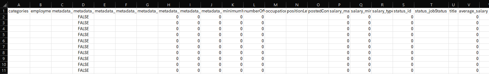
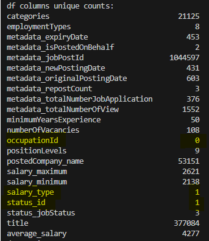
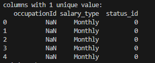
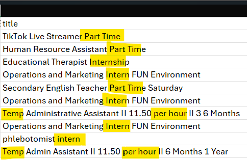
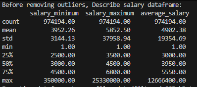
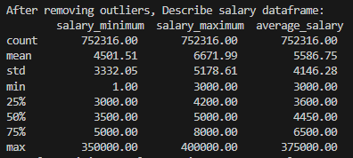

## Steps performed to clean raw data
### (1) check dataframe if "categories" column contain blank entries (either empty or string with spaces)
- create a boolean masking "blank_categories_mask" to filter out blank entries
- 3,988 rows are blank and are removed from dataset
- 

### (2) check columns with data that are not meaningful
- drop occupationId column as it contains no data
- drop status_id column as it contains non-informative data
- drop salary_type column as the related salary fields capture salary in different forms (per hour, per month, per year)
-       

### (3) check data accuracy for min/max/avg salary
- salary_minimum cannot be higher than salary_maximum
- average_salary must be between salary_minimum and salary_maximum
- no data issues observed

### (4) check for any duplicate job post id with "metadata_jobPostId" column
- no duplicates observed

### (5) check if text columns (postedCompany_name, title) contain inconsistent cases and special characters
- 447 out of 53,151 company names are in upper case. to standardise all company names to be capitalized
- replace ampersand to "and"
- remove special characters with regex
- remove leading and trailing whitespace
- replace multiple spaces with a single space

### (6) identify the employment types of jobs to focus on
- based on employment types, to focus only on 95% of jobs: Permanent (44%), Full Time (38%) and Contract (13%)
- 
- to remove jobs with titles that are meant for excluded employment types e.g. parttime/part time, intern, temp
- to remove jobs with titles that contain hourly rates
- 

### (7) identify targeted data set and remove outliers
- to remove outliers where average salary > 400,000
- to remove outliers where average salary seems too high for job posting i.e. metadata_jobPostId = MCF-2024-0351969, MCF-2024-0492535
- 
-         

